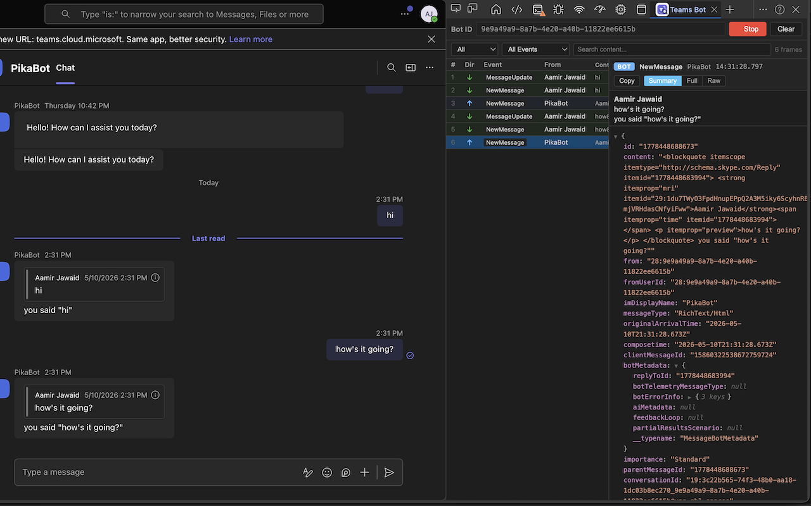
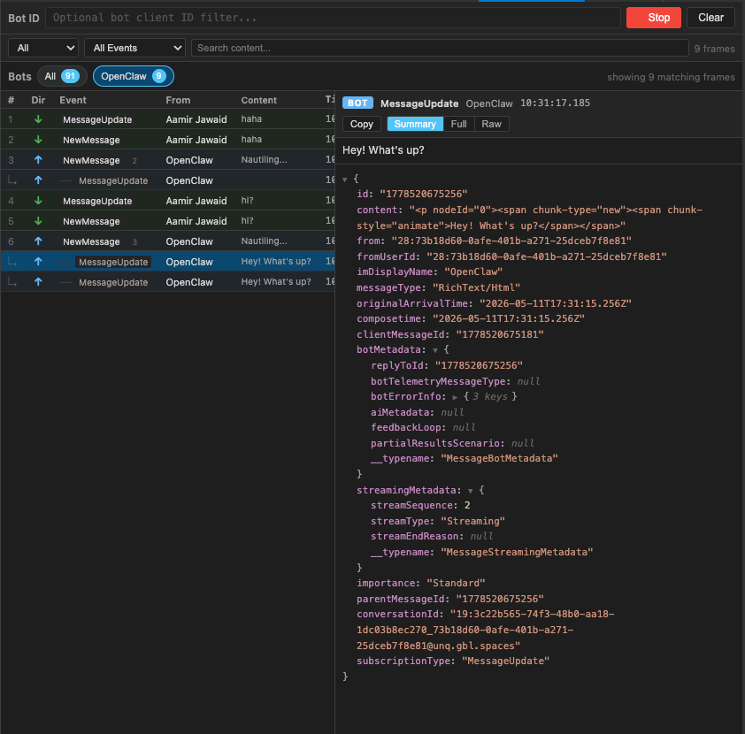
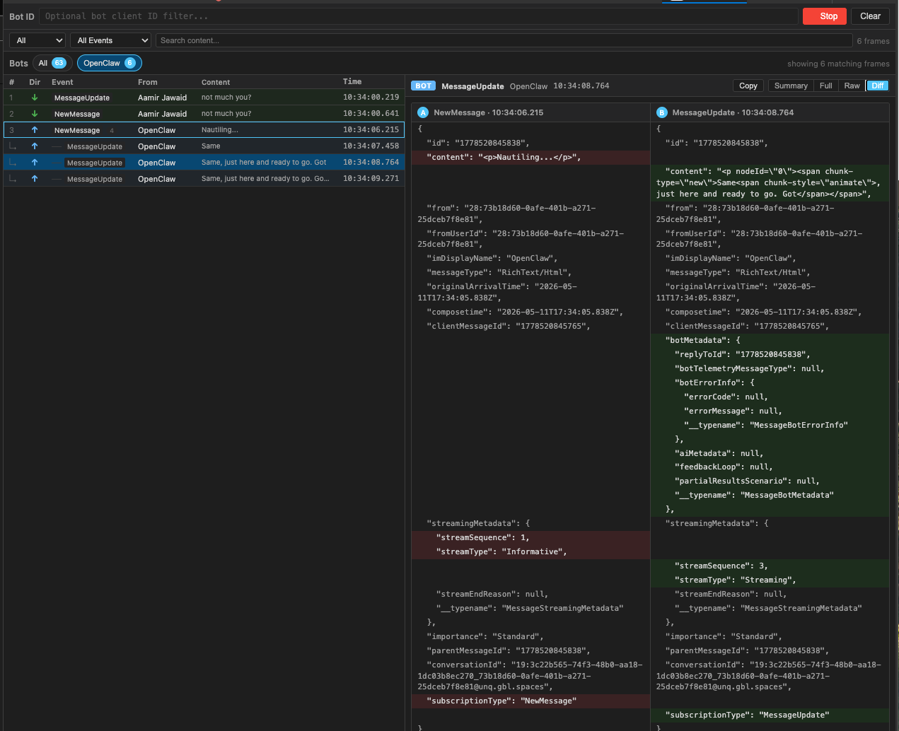
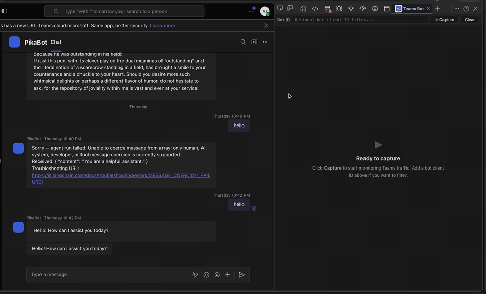

<div align="center">
  

  # Teams DevTools Extension

  Inspect Microsoft Teams bot traffic from a tidy DevTools panel.

  
  
  
</div>

> [!IMPORTANT]
> This project is an independent tool and is not affiliated with, endorsed by, sponsored by, or supported by Microsoft.

## What is this?

Teams DevTools Extension adds a **Teams Bot** tab to Chrome/Edge DevTools. Open Teams in the browser, hit **Capture**, and inspect bot-related traffic without spelunking through the regular Network tab.

It is useful when you want to quickly see:

- incoming and outgoing bot messages
- Teams message events such as `NewMessage`, `PartialMessageUpdate`, and `MessageUpdate`
- streaming bot replies grouped by message id
- side-by-side diffs between two selected message events
- parsed message summaries
- full structured payloads
- raw captured traffic when you need the gnarly bits



### Streaming update hierarchy

Streaming replies are grouped under the same message id, so you can follow the whole lifecycle from `NewMessage` through each `PartialMessageUpdate` and final `MessageUpdate`.



### Message diff view

Cmd/Ctrl-click two message events to enable the **Diff** tab and compare their parsed summaries side by side.



## Demo



## Features

- **DevTools-native workflow** — lives beside the browser DevTools tabs.
- **Bot ID filtering** — optionally filter to a specific bot client ID / Azure AD app ID.
- **Direction filters** — separate incoming and outgoing traffic.
- **Event filters** — narrow down noisy Teams events.
- **Search** — find content inside captured frames.
- **Streaming hierarchy** — group related updates by message id.
- **Diff view** — compare two selected message events side by side.
- **Summary, full, raw, and diff views** — start readable, dive deep when needed.
- **Local-first** — captured traffic is displayed locally in your browser.

## Install locally

### Option 1: use a release build

1. Download the latest `teams-devtools-extension-*.zip` from [Releases](https://github.com/heyitsaamir/teams-devtools-extension/releases).
2. Unzip it somewhere you can keep around, for example `~/Extensions/teams-devtools-extension`.
3. Open `edge://extensions` or `chrome://extensions`.
4. Turn on **Developer mode**.
5. Click **Load unpacked**.
6. Select the unzipped extension folder.
7. Open [Teams](https://teams.cloud.microsoft/) in the browser.
8. Open DevTools.
9. Select the **Teams Bot** tab.
10. Click **Capture**.

### Option 2: build from source

```bash
git clone https://github.com/heyitsaamir/teams-devtools-extension.git
cd teams-devtools-extension
npm install
npm run build
```

Then load the generated `dist/` folder with **Load unpacked** from `edge://extensions` or `chrome://extensions` (on Edge, ensure `Developer Mode` is enabled).

> Extension scripts are injected when the Teams page loads. If the panel looks empty, reload the extension, refresh the Teams tab, reopen DevTools, and click **Capture**.

## Supported Teams domains

The extension is configured for:

- `https://teams.microsoft.com/*`
- `https://*.teams.microsoft.com/*`
- `https://teams.cloud.microsoft/*`
- `https://*.teams.cloud.microsoft/*`

## Package for publishing

```bash
npm run zip
```

This creates:

```text
teams-devtools-extension.zip
```

Upload that zip to the Chrome Web Store or Microsoft Edge Add-ons dashboard.

## CI and releases

GitHub Actions builds the extension when code or extension assets change. Build artifacts are attached to the workflow run.

To create a GitHub release and release zip, either:

```bash
git tag v0.1.1
git push origin v0.1.1
```

or run the **Release extension** workflow manually from GitHub and provide a version like `0.1.1`.

Release builds stamp `dist/manifest.json` with the release version before creating the zip.

## Privacy

The extension can inspect Teams page traffic that is visible to the browser so it can show bot messages in the DevTools panel. Captured traffic is not sent to external servers.

The extension uses local browser storage only to remember optional filter settings, such as recent bot IDs.

Read the full policy: [PRIVACY.md](./PRIVACY.md)

## Development

```bash
npm install
npm run build
```

Watch mode:

```bash
npm run dev
```

Useful scripts:

| Script | What it does |
| --- | --- |
| `npm run build` | Type-checks and builds the extension into `dist/` |
| `npm run dev` | Rebuilds in watch mode |
| `npm run zip` | Builds and creates the publishable zip |
| `npm run clean` | Removes build output |

